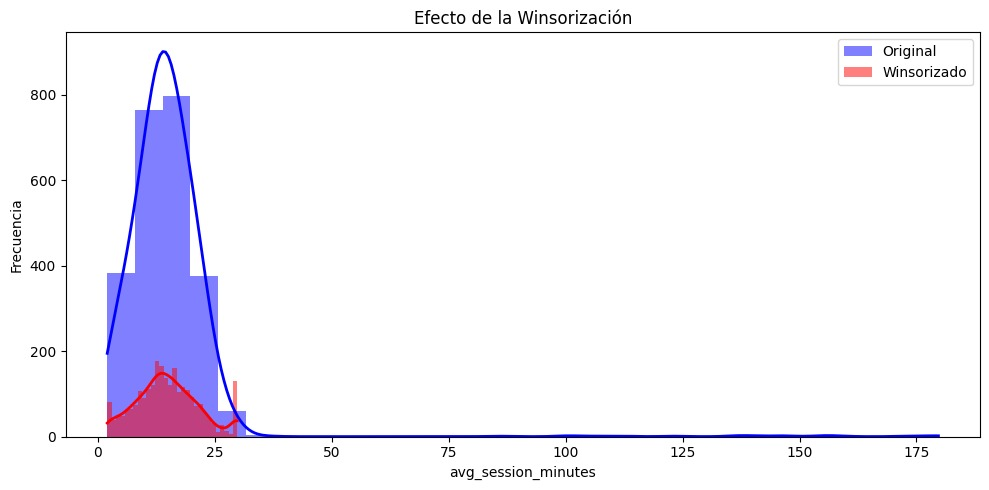

<p align="center">
  
</p>

# Laboratorio No 2

Propósito del laboratorio: construir un proceso ETL que permita limpiar, transformar y 
preparar un dataset de usuarios para entrenar y evaluar un modelo de regresión logística 
capaz de predecir si un usuario convertirá o no a un plan pago al finalizar su trial.

## Integrantes

**Nombre:** Roberto José Guerrero Criollo  
*Correo:* roberto_jos.guerrero@uao.edu.co  
   
**Nombre:** Melissa Muñoz Buitron  
*Correo:* melissa.munoz@uao.edu.co

## ETL: Extracción, transformación y carga de datos🚦

* **Fase 1: Extracción de datos** – Selección de fuentes de datos adecuadas, carga de datos brutos desde archivos CSV mediante Python, estandarización y almacenamiento seguro en una base de datos SQLite.

* **Fase 2: Limpieza y transformación de datos** – Análisis exploratorio de datos (EDA), gestión de valores faltantes y duplicados, fusión de conjuntos de datos y aplicación de transformaciones y estandarizaciones de datos, identificación de outliers, imputación de datos, feature engineering

* **Fase 3: Carga de datos y pipeline ETL** – Carga del conjunto de datos final en una tabla dedicada de la base de datos SQLite, automatización de todo el proceso ETL mediante Prefect y creación de un modelo de regresión logística.

**Pasos clave en esta fase:**
1. 📁 **Fuentes de datos:** Selección de archivos CSV que contienen las variables de una plataforma de servicios en línea que ofrece un periodo de trial a nuevos usuarios.

2. 🛠️ **Extracción de datos:** Cargar los datos en DataFrames de pandas, estandarizarlos y almacenarlos en una base de datos SQLite para su posterior procesamiento.

3. 🧼 **Limpieza de datos:**
* Manejo de valores faltantes mediante la sustitución o eliminación de inconsistencias.

* Estandarización de nombres y formatos de columnas.

* Eliminación de registros duplicados.

4. 🔍 **Análisis exploratorio de datos (EDA):** Identificación de distribuciones, patrones y correlaciones de datos, y realización de análisis estadísticos y visualización de relaciones.

5. 🔄 **Transformación de datos:**
* Filtrado y selección de características relevantes.

* Reclasificación de variables categóricas.

* Identificación de outliers

* Imputación de datos

* Feature engineering

6. 🧾 **Carga del conjunto de datos final:** Almacenamiento del conjunto de datos completamente procesado en una nueva tabla estructurada de PostgreSQL para su posterior uso en análisis e informes.

7. 🤖 **Automatización de ETL con Prefect:**
* Orquestación del flujo de trabajo ETL completo mediante Prefect.

* Automatización de la secuencia de tareas: preprocesamiento, creación de tablas de preparación, extracción, transformación y carga.

* Entrenamiento y evaluación del modelo de regresión logística.

## Objetivo del proyecto 🧠

Una plataforma de servicios en línea ofrece un periodo de trial a nuevos usuarios. La organización desea identificar, con base en la actividad observada durante ese periodo, qué usuarios tienen mayor probabilidad de contratar un plan de pago. El reto no consiste solo en entrenar un modelo, sino en construir un proceso ETL reproducible que deje los datos listos para análisis y predicción. 

## Tecnologías utilizadas 🛠

- 👩‍💻 **Lenguaje de programación:** Python
- 💻 **Entornos:**
  - 📔 **Jupyter Notebook:** Para el pipeline de la exploración, transformación y visualización interactiva de datos.
  - 🛫 **Prefect:** Para la automatización y orquestación de flujos de trabajo ETL.
- 🗄️ **Base de datos:** SQLite
- 📦 **Bibliotecas:**
  - 🐼 **pandas:** Para la manipulación y el análisis de datos.
  - 🧱 **sqlite3:** Para la conexión a la base de datos y las consultas.
  - 📉 **seaborn y matplotlib:** Visualización de datos.
  - 🧪 **scikit-learn:** Análisis estadístico y transformaciones.
  - ⚖️ **imbalanced-learn:** Técnicas de sobremuestreo para equilibrar los datos.
  - ⏱️ **perfect:** Orquestación y programación de flujos de trabajo.

## Cargar Datos

Se carga el dataset requerido para este laboratorio. Este dataset cuenta con:.

```text
Dataset principal: (2545, 27)
Dataset diccionario: (27, 3)
```
# EDA

En esta sección se realiza el análisis exploratorio de los datos (EDA) con reportes visuales mediante la librería Sweetviz, el cual nos da en primera instancia información de cómo está estructurado el dataset

## Limpieza y Transformación del dataset

En esta sección se realiza el proceso de limpieza y transformación del dataset. Para ello, se lleva a cabo la identificación y el análisis de la información contenida en el dataset, identificando tipo de datos, valores nulos, registros duplicados, entre otros.

A partir de este análisis, se procede a organizar, corregir y depurar la información, de manera que los datos queden estructurados y preparados para el entrenamiento de un modelo que permita predecir si un usuario convertirá o no a un plan pago al finalizar su trial.

```text
<class 'pandas.core.frame.DataFrame'>
RangeIndex: 2545 entries, 0 to 2544
Data columns (total 27 columns):
 #   Column                            Non-Null Count  Dtype  
---  ------                            --------------  -----  
 0   user_id                           2545 non-null   object 
 1   signup_date                       2545 non-null   object 
 2   trial_end_date                    2545 non-null   object 
 3   trial_length_days                 2545 non-null   int64  
 4   age                               2469 non-null   float64
 5   country                           2506 non-null   object 
 6   gender                            2545 non-null   object 
 7   device_type                       2504 non-null   object 
 8   acquisition_channel               2545 non-null   object 
 9   city_tier                         2545 non-null   object 
 10  preferred_plan_before_conversion  2545 non-null   object 
 11  days_active_trial                 2545 non-null   int64  
 12  sessions_count                    2545 non-null   int64  
 13  avg_session_minutes               2443 non-null   float64
 14  features_used                     2545 non-null   int64  
 15  support_tickets                   2545 non-null   int64  
 16  emails_opened                     2545 non-null   int64  
 17  webinar_attended                  2545 non-null   int64  
 18  payment_method_on_file            2545 non-null   int64  
 19  referred_friend                   2545 non-null   int64  
 20  discount_offered_pct              2545 non-null   object 
 21  plan_page_views                   2545 non-null   int64  
 22  last_activity_gap_days            2545 non-null   int64  
 23  satisfaction_score                2393 non-null   float64
 24  monthly_income_usd                2426 non-null   object 
 25  converted_to_paid_plan            2545 non-null   int64  
 26  selected_plan                     2545 non-null   object 
dtypes: float64(3), int64(12), object(12)
memory usage: 537.0+ KB
```

Se puede evidenciar que hay columnas que les hace falta datos

## Id_user duplicados

Se logra identificar que la variable "user_id" tiene valores duplicados

Se identificaron 45 registros duplicados en el dataset, lo que puede generar sesgos en el análisis y afectar el rendimiento del modelo al sobre-representar ciertos casos. Por esta razón, se toma la decisión de eliminarlos evitando distorsiones en las métricas y resultados del modelo a entrenar.

## Normalización tamaño de letra

En el dataset se evidenció la presencia de registros con nombres inconsistentes en su formato, algunos en mayúsculas, otros en minúsculas o con combinaciones de ambas. Esta variabilidad puede generar duplicidades lógicas y afectar la calidad del análisis. Por ello, se decidió normalizar los nombres a un formato estándar con la primera letra en mayúscula, garantizando consistencia en los datos y facilitando su correcto procesamiento y análisis.

## Normalización formato fecha

Se evidencia la presencia de múltiples formatos de fecha dentro del dataset, lo que puede generar inconsistencias en el análisis y errores en los procesos de transformación. Por esta razón, se realiza la conversión de todas las fechas a un formato estándar (DD/MM/YYYY), con el fin de garantizar un correcto procesamiento

```text
Formatos en signup_date:
 signup_date
YYYY-MM-DD    2301
DD/MM/YYYY     199
Name: count, dtype: int64
Formatos en trial_end_date:
 trial_end_date
YYYY-MM-DD    2348
MM-DD-YYYY     152
Name: count, dtype: int64
```
## Valores nulos

En esta sección se evidencia que varias variables dentro del dataset presentan valores nulos, esto puede afectar la calidad del análisis y el desempeño de los modelos. Por esta razón, se procede a tratar estos valores mediante diferentes técnicas de imputación o limpieza.

```text
user_id                               0
signup_date                           0
trial_end_date                        0
trial_length_days                     0
age                                  75
country                              38
gender                                0
device_type                          38
acquisition_channel                   0
city_tier                             0
preferred_plan_before_conversion      0
days_active_trial                     0
sessions_count                        0
avg_session_minutes                  99
features_used                         0
support_tickets                       0
emails_opened                         0
webinar_attended                      0
payment_method_on_file                0
referred_friend                       0
discount_offered_pct                  0
plan_page_views                       0
last_activity_gap_days                0
satisfaction_score                  150
monthly_income_usd                  118
converted_to_paid_plan                0
selected_plan                         0
dtype: int64
```
## Imputar valores "no registra"

Teniendo en cuenta que las variables con valores nulos, como "age", "country", "device_type" y "monthly_income_usd", no presentan una alta relevancia para el modelo a desarrollar, se decide imputar dichos valores con la etiqueta "no registra". Esta decisión permite mantener la integridad del dataset sin introducir sesgos significativos en el modelo.

Ahora bien, dentro de los valores nulos se encuentran las variables "avg_session_minutes" y "satisfaction_score", las cuales son relevantes para el modelo, ya que aportan información directa sobre el comportamiento y la experiencia del usuario. Por esta razón se decide realizar un análisis descriptivo de ambas variables, con el fin de comprender su distribución y determinar qué estrategia de imputación se utiliza para este caso.

```text
user_id                               0
signup_date                           0
trial_end_date                        0
trial_length_days                     0
age                                   0
country                               0
gender                                0
device_type                           0
acquisition_channel                   0
city_tier                             0
preferred_plan_before_conversion      0
days_active_trial                     0
sessions_count                        0
avg_session_minutes                  99
features_used                         0
support_tickets                       0
emails_opened                         0
webinar_attended                      0
payment_method_on_file                0
referred_friend                       0
discount_offered_pct                  0
plan_page_views                       0
last_activity_gap_days                0
satisfaction_score                  150
monthly_income_usd                    0
converted_to_paid_plan                0
selected_plan                         0
dtype: int64
```

## Identificacion de outliers

En el análisis de valores atípicos de las variables seleccionadas para el modelo se identificó que, en la mayoría de los casos, estos corresponden a comportamientos reales de los usuarios y no a errores en los datos. Por ello, las observaciones extremas en days_active_trial, sessions_count, features_used, last_activity_gap_days y satisfaction_score se conservaron, ya que representan patrones válidos como usuarios altamente activos, exploración intensiva de funcionalidades o períodos reales de inactividad. Únicamente en la variable avg_session_minutes se aplicó un proceso de winsorización, con el fin de reducir el efecto de valores excesivamente extremos sin eliminar información relevante del dataset.


## Tratamiento de outliers

El gráfico muestra el efecto de la winsorización sobre la variable avg_session_minutes, comparando la distribución original con la transformada. Inicialmente, la variable presenta una fuerte asimetría positiva, con una cola larga hacia la derecha debido a la presencia de valores extremos elevados. Después del proceso de winsorización, se observa que estos valores atípicos han sido recortados a un límite superior, lo que reduce significativamente la dispersión y elimina la influencia de extremos excesivos sin perder la estructura general de los datos. Como resultado, la distribución se vuelve más concentrada y estable, facilitando su uso en el modelo y disminuyendo el impacto que los outliers podrían tener en el ajuste de la regresión logística.



## Imputacion de datos sobre la mediana

```text
=== avg_session_minutes ===
count    2500.00000
mean       14.87416
std         6.67248
min         2.00000
25%        10.40000
50%        14.50000
75%        19.00000
max        29.80000
Name: avg_session_minutes, dtype: float64
Moda: 29.8
=== satisfaction_score ===
count    2350.000000
mean        7.120553
std         1.694505
min         1.000000
25%         5.900000
50%         7.100000
75%         8.400000
max        10.000000
Name: satisfaction_score, dtype: float64
Moda: 10.0
```


A partir del análisis gráfico de las variables avg_session_minutes y satisfaction_score, se pueden extraer las siguientes observaciones:
Para la variable avg_session_minutes, se evidencia una distribución asimétrica positiva, donde la mayoría de los valores se concentran en rangos bajos, aproximadamente entre 5 y 25 minutos. Sin embargo, se observa la presencia de valores atípicos elevados

Por otro lado, la variable satisfaction_score presenta una distribución aproximadamente simétrica y cercana a una distribución normal, con valores concentrados entre 5 y 9.

Para las variables avg_session_minutes y satisfaction_score, se decide imputar los valores nulos utilizando la mediana, debido a que esta medida es robusta frente a valores atípicos y permite preservar la distribución original de los datos.

```text
user_id                             0
signup_date                         0
trial_end_date                      0
trial_length_days                   0
age                                 0
country                             0
gender                              0
device_type                         0
acquisition_channel                 0
city_tier                           0
preferred_plan_before_conversion    0
days_active_trial                   0
sessions_count                      0
avg_session_minutes                 0
features_used                       0
support_tickets                     0
emails_opened                       0
webinar_attended                    0
payment_method_on_file              0
referred_friend                     0
discount_offered_pct                0
plan_page_views                     0
last_activity_gap_days              0
satisfaction_score                  0
monthly_income_usd                  0
converted_to_paid_plan              0
selected_plan                       0
dtype: int64
```

Se verifican que ya no haya valores nulos dentro del dataset

## Variable categorica

Para la variable preferred_plan_before_conversion se evidencia que es de tipo categórico, con tres categorías principales: Basic, Standard y Premium.

```text
preferred_plan_before_conversion
Basic       1018
Standard     954
Premium      528
Name: count, dtype: int64
```

Se realiza un proceso de codificación, transformando cada categoría en un valor numérico. Las categorías fueron asignadas de la siguiente manera: 
Basic → 0, Premium → 1 y Standard → 2. 
Esta transformación permite que la variable pueda ser interpretada por el modelo sin perder la información original.

```text
preferred_plan_before_conversion  preferred_plan_encoded
Basic                             0                         1018
Standard                          2                          954
Premium                           1                          528
Name: count, dtype: int64
```

```text
user_id                              object
signup_date                          object
trial_end_date                       object
trial_length_days                     int64
age                                  object
country                              object
gender                               object
device_type                          object
acquisition_channel                  object
city_tier                            object
preferred_plan_before_conversion     object
days_active_trial                     int64
sessions_count                        int64
avg_session_minutes                 float64
features_used                         int64
support_tickets                       int64
emails_opened                         int64
webinar_attended                      int64
payment_method_on_file                int64
referred_friend                       int64
discount_offered_pct                  int64
plan_page_views                       int64
last_activity_gap_days                int64
satisfaction_score                  float64
monthly_income_usd                   object
converted_to_paid_plan                int64
selected_plan                        object
preferred_plan_encoded                int64
dtype: object
```

# Feature Engineering

En la etapa de creación de variables para el modelo, se seleccionan del dataset aquellas características que aportan información relevante para predecir la conversión del usuario. En particular, se priorizan las variables asociadas al comportamiento durante el período de prueba, ya que estas reflejan de manera más directa el nivel de interacción, compromiso y experiencia del usuario con la plataforma.

Las variables seleccionadas:

sessions_count, days_active_trial, avg_session_minutes → para los ratios
features_used → intensidad de uso
emails_opened, webinar_attended, plan_page_views → engagement
payment_method_on_file, discount_offered_pct → intención comercial
trial_length_days, last_activity_gap_days → cercanía al cierre

```text
minutos_totales  intensidad_uso  engagement_score  intencion_comercial
0            221.0             286                 5                    1
1            151.2              56                 7                   11
2            133.0              90                 5                    1
3            312.5             300                12                   15
4            341.0             242                 8                   18
5            107.0              40                 9                   12
6            204.0             380                16                    2
7            121.8             210                 8                   23
8            164.7             108                11                    3
9            200.6             204                 9                    3
```

# Modelo de Regresión Lógistica

## Separación del dataset en train/test/validation

Se realiza la preparación de los datos para el entrenamiento y evaluación del modelo. 

Se definen las variables predictoras (X), seleccionando aquellas características relevantes del dataset. Luego, se define la variable objetivo (y), que en este caso indica si el usuario se convirtió a un plan pago.

Se divide el dataset en tres subconjuntos: entrenamiento (60%), prueba (20%) y validación (20%).

```text
Train      : 1500 registros (60.0%)
Test       : 500 registros (20.0%)
Validation : 500 registros (20.0%)
Proporción target en Train      : 0.2340
Proporción target en Test       : 0.2340
Proporción target en Validation : 0.2340
```

## Escalado de las variables para los outliers

En esta etapa se realiza el escalado de las variables utilizando el método RobustScaler, con el objetivo de reducir el impacto de los valores atípicos en el modelo.

```text
Escalado aplicado correctamente
Shape Train: (1500, 11)
Shape Test : (500, 11)
Shape Val  : (500, 11)
```

## Modelo regresión lógistica

Se utiliza un modelo de regresión logística para este problema ya que la variable objetivo converted_to_paid_plan es binaria (0 o 1), y este algoritmo está diseñado precisamente para predecir probabilidades entre 0 y 1.

En este punto se entrena el modelo.

## Evaluación del modelo

```text
=== MÉTRICAS EN TEST ===
Accuracy  : 0.6580
Precision : 0.3750
Recall    : 0.6923
F1        : 0.4865
ROC-AUC   : 0.7320
=== MÉTRICAS EN VALIDATION ===
Accuracy  : 0.6660
Precision : 0.3821
Recall    : 0.6923
F1        : 0.4924
ROC-AUC   : 0.7362
```


# Base de datos SQL - SQLite
