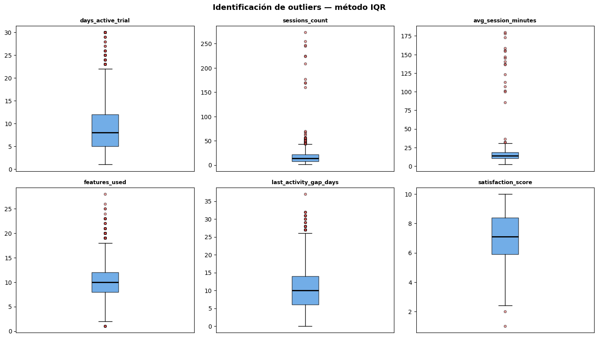
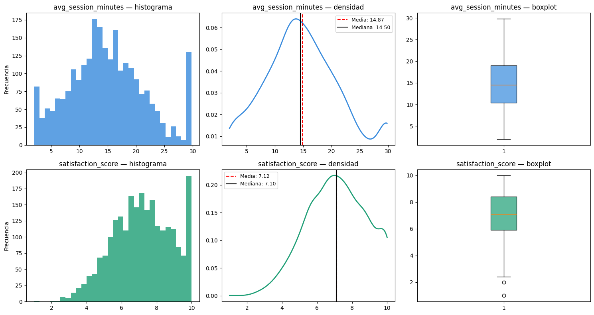
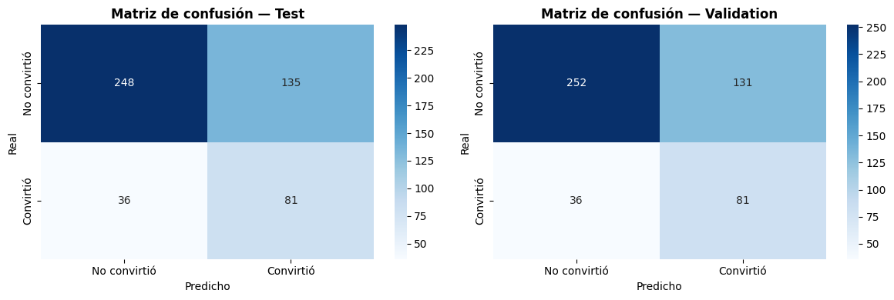

<p align="center">
  
</p>

<center> <h1>LABORATORIO No 1 - ETL</h1> </center>

Propósito del laboratorio: construir un proceso ETL que permita limpiar, transformar y 
preparar un dataset de usuarios para entrenar y evaluar un modelo de regresión logística 
capaz de predecir si un usuario convertirá o no a un plan pago al finalizar su trial.

# INTEGRANTES

**Nombre:** Roberto José Guerrero Criollo  
*Correo:* roberto_jos.guerrero@uao.edu.co  
   
**Nombre:** Melissa Muñoz Buitron  
*Correo:* melissa.munoz@uao.edu.co

Para la importacion de los datos se utilizan las siguientes librerias

```python
import os
import numpy as np

# Parche de compatibilidad con sweetviz (debe ir ANTES de importar sweetviz)
if not hasattr(np, 'VisibleDeprecationWarning'):
    np.VisibleDeprecationWarning = DeprecationWarning

import pandas as pd
pd.options.mode.chained_assignment = None

import sweetviz as sv
import matplotlib.pyplot as plt
import json
import sqlite3
from sklearn.preprocessing import LabelEncoder
from sklearn.model_selection import train_test_split
from sklearn.preprocessing import RobustScaler
from sklearn.linear_model import LogisticRegression
from sklearn.metrics import accuracy_score, precision_score, recall_score, f1_score, confusion_matrix, roc_auc_score
import seaborn as sns
from scipy.stats import gaussian_kde, mstats
```

# CARGAR DATOS

Se carga el dataset requerido para este laboratorio. Este datasetn cuenta con 2.545 registros.

```python
trial_conversion_users = pd.read_csv(r"C:\Users\Molly\Desktop\UAO\CLASE ETL\Lab_2\lab2_trial_conversion_users.csv")
data_dictionary = pd.read_csv(r"C:\Users\Molly\Desktop\UAO\CLASE ETL\Lab_2\lab2_data_dictionary.csv")

print("Dataset principal:",trial_conversion_users.shape)
print("Dataset diccionario:",data_dictionary.shape)
```

```text
Dataset principal: (2545, 27)
Dataset diccionario: (27, 3)
```

# VISUALIZACIÓN DE LOS DATASET

En esta sección se muestran el dataset que fue cargado previamente para su posterior análisis.

## Dataset principal

```python
trial_conversion_users
```

_Visualización tabular omitida en el README para mantenerlo legible en GitHub._

El siguiente dataset solo entrega información descriptiva de las variables que trae el dataset principal.

```python
data_dictionary
```

_Visualización tabular omitida en el README para mantenerlo legible en GitHub._

# EDA

En esta sección se realiza el análisis exploratorio de los datos (EDA) con reportes visuales mediante la librería Sweetviz, el cual nos da en primera instancia información de como esta estructurada el dataset

```python
eda_trial_conversion_users = sv.analyze(trial_conversion_users)
eda_trial_conversion_users.show_notebook()
```

_Salida interactiva generada en el notebook. No se incrusta directamente en GitHub._

# LIMPIEZA Y TRANSFORMACIÓN DEL DATASET

En esta sección se realiza el proceso de limpieza y transformación del datasets. Para ello, se lleva a cabo la identificación y el análisis de la información contenida en el dataset, identificando tipo de datos, valores nulos, registros duplicados, entre otros.
A partir de este análisis, se procede a organizar, corregir y depurar la información, de manera que los datos queden estructurados y preparados para el entrenamiento de un modelo que permita predecir si un usuario convertirá o no a un plan pago al finalizar su trial.

```python
trial_conversion_users.info()
```

```text
<class 'pandas.core.frame.DataFrame'>
RangeIndex: 2545 entries, 0 to 2544
Data columns (total 27 columns):
 #   Column                            Non-Null Count  Dtype  
---  ------                            --------------  -----  
 0   user_id                           2545 non-null   object 
 1   signup_date                       2545 non-null   object 
 2   trial_end_date                    2545 non-null   object 
 3   trial_length_days                 2545 non-null   int64  
 4   age                               2469 non-null   float64
 5   country                           2506 non-null   object 
 6   gender                            2545 non-null   object 
 7   device_type                       2504 non-null   object 
 8   acquisition_channel               2545 non-null   object 
 9   city_tier                         2545 non-null   object 
 10  preferred_plan_before_conversion  2545 non-null   object 
 11  days_active_trial                 2545 non-null   int64  
 12  sessions_count                    2545 non-null   int64  
 13  avg_session_minutes               2443 non-null   float64
 14  features_used                     2545 non-null   int64  
 15  support_tickets                   2545 non-null   int64  
 16  emails_opened                     2545 non-null   int64  
 17  webinar_attended                  2545 non-null   int64  
 18  payment_method_on_file            2545 non-null   int64  
 19  referred_friend                   2545 non-null   int64  
 20  discount_offered_pct              2545 non-null   object 
 21  plan_page_views                   2545 non-null   int64  
 22  last_activity_gap_days            2545 non-null   int64  
 23  satisfaction_score                2393 non-null   float64
 24  monthly_income_usd                2426 non-null   object 
 25  converted_to_paid_plan            2545 non-null   int64  
 26  selected_plan                     2545 non-null   object 
dtypes: float64(3), int64(12), object(12)
memory usage: 537.0+ KB
```

Se puede evidenciar que hay columnas que les hace falta datos

### Id_user duplicados

Se logra identificar que la varibale "user_id" tiene valores duplicados

```python
trial_conversion_users.duplicated(subset=["user_id"], keep=False).sum()
```

```text
np.int64(90)
```

```python
user_id_duplicados = trial_conversion_users[trial_conversion_users.duplicated(subset=["user_id"])]
user_id_duplicados
```

_Visualización tabular omitida en el README para mantenerlo legible en GitHub._

```python
trial_conversion_users = eda_trial_conversion_users = trial_conversion_users.drop_duplicates(subset=["user_id"])
trial_conversion_users
```

_Visualización tabular omitida en el README para mantenerlo legible en GitHub._

Se identificaron 45 registros duplicados en el dataset, lo que puede generar sesgos en el análisis y afectar el rendimiento del modelo al sobre-representar ciertos casos. Por esta razón, se toma la decisión de eliminarlos evitando distorsiones en las métricas y resultados del modelo a entrenar.

### Normalización tamaño de letra

En el dataset se evidenció la presencia de registros con nombres inconsistentes en su formato, algunos en mayúsculas, otros en minúsculas o con combinaciones de ambas. Esta variabilidad puede generar duplicidades lógicas y afectar la calidad del análisis. Por ello, se decidió normalizar los nombres a un formato estándar con la primera letra en mayúscula, garantizando consistencia en los datos y facilitando su correcto procesamiento y análisis.

```python
def normalizar_categoricas(df, columnas):
    for col in columnas:
        df[col] = df[col].str.strip().str.title()
    return df

# Aplicar
columnas_a_normalizar = ["country", "device_type", "acquisition_channel", "gender", "city_tier", "preferred_plan_before_conversion", "selected_plan"]
trial_conversion_users = normalizar_categoricas(trial_conversion_users, columnas_a_normalizar)

# Verificar
trial_conversion_users
```

_Visualización tabular omitida en el README para mantenerlo legible en GitHub._

### Normalización formato fecha

Se evidencia la presencia de múltiples formatos de fecha dentro del dataset, lo que puede generar inconsistencias en el análisis y errores en los procesos de transformación. Por esta razón, se realiza la conversión de todas las fechas a un formato estándar (DD/MM/YYYY), con el fin de gararntizar un correcto procesamiento

```python
# signup_date
formatos_signup = trial_conversion_users["signup_date"].astype(str).apply(
    lambda x: "YYYY-MM-DD" if x[4] == "-" else "DD/MM/YYYY"
).value_counts()
print("Formatos en signup_date:\n", formatos_signup)

# trial_end_date
formatos_trial = trial_conversion_users["trial_end_date"].astype(str).apply(
    lambda x: "YYYY-MM-DD" if x[4] == "-" else "MM-DD-YYYY"
).value_counts()
print("\nFormatos en trial_end_date:\n", formatos_trial)
```

```text
Formatos en signup_date:
 signup_date
YYYY-MM-DD    2301
DD/MM/YYYY     199
Name: count, dtype: int64
Formatos en trial_end_date:
 trial_end_date
YYYY-MM-DD    2348
MM-DD-YYYY     152
Name: count, dtype: int64
```

```python
def normalizar_fechas(df, columnas):
    for col in columnas:
        df[col] = pd.to_datetime(
            df[col], format="mixed", dayfirst=True
        ).dt.strftime("%d/%m/%Y")
    return df

# Aplicar
columnas_fechas = ["signup_date", "trial_end_date"]
trial_conversion_users = normalizar_fechas(trial_conversion_users, columnas_fechas)

trial_conversion_users
```

_Visualización tabular omitida en el README para mantenerlo legible en GitHub._

### Valores nulos

En esta sección se evidencia que varias variables dentro del dataset presentan valores nulos, esto puede afectar la calidad del análisis y el desempeño de los modelos. Por esta razón, se procede a tratar estos valores mediante diferentes técnicas de imputación o limpieza.

```python
trial_conversion_users.isnull().sum()
```

```text
user_id                               0
signup_date                           0
trial_end_date                        0
trial_length_days                     0
age                                  75
country                              38
gender                                0
device_type                          38
acquisition_channel                   0
city_tier                             0
preferred_plan_before_conversion      0
days_active_trial                     0
sessions_count                        0
avg_session_minutes                  99
features_used                         0
support_tickets                       0
emails_opened                         0
webinar_attended                      0
payment_method_on_file                0
referred_friend                       0
discount_offered_pct                  0
plan_page_views                       0
last_activity_gap_days                0
satisfaction_score                  150
monthly_income_usd                  118
converted_to_paid_plan                0
selected_plan                         0
dtype: int64
```

```python
def limpiar_columna_numerica(df, columna, simbolo):
    df[columna] = df[columna].astype(str).str.replace(simbolo, "", regex=False)
    df[columna] = pd.to_numeric(df[columna], errors="coerce")
    return df

# Aplicar
trial_conversion_users = limpiar_columna_numerica(trial_conversion_users, "monthly_income_usd", "$")
trial_conversion_users = limpiar_columna_numerica(trial_conversion_users, "discount_offered_pct", "%")
# Verificar
print(trial_conversion_users["monthly_income_usd"].value_counts())
print(trial_conversion_users["discount_offered_pct"].value_counts())
```

```text
monthly_income_usd
250.0     112
1616.0      6
1488.0      5
1034.0      5
1307.0      5
         ... 
1943.0      1
2085.0      1
1387.0      1
1184.0      1
1501.0      1
Name: count, Length: 1478, dtype: int64
discount_offered_pct
0     956
10    485
20    369
15    367
5     205
25    118
Name: count, dtype: int64
```

### Imputar valores "no registra"

Teniendo en cuenta que las variables con valores nulos, como "age", "country", "device_type" y "monthly_income_usd", no presentan una alta relevancia para el modelo a desarrollar, se decide imputar dichos valores con la etiqueta "no registra". Esta decisión permite mantener la integridad del dataset sin introducir sesgos significativos en el modelo.

```python
def imputar_no_registra(df, columnas):
    for col in columnas:
        df[col] = df[col].fillna("No registra")
    return df

# Aplicar
columnas_no_registra = ["age", "country", "device_type","monthly_income_usd"]
trial_conversion_users = imputar_no_registra(trial_conversion_users, columnas_no_registra)

# Verificar
trial_conversion_users
```

_Visualización tabular omitida en el README para mantenerlo legible en GitHub._

Ahora bien, dentro de los valores nulos se encuentran las variables "avg_session_minutes" y "satisfaction_score", las cuales son relevantes para el modelo, ya que aportan información directa sobre el comportamiento y la experiencia del usuario. Por esta razón se decide realizar un análisis descriptivo de ambas variables, con el fin de comprender su distribución y determinar que estrategia de imputación se utiliza para este caso.

```python
trial_conversion_users.isnull().sum()
```

```text
user_id                               0
signup_date                           0
trial_end_date                        0
trial_length_days                     0
age                                   0
country                               0
gender                                0
device_type                           0
acquisition_channel                   0
city_tier                             0
preferred_plan_before_conversion      0
days_active_trial                     0
sessions_count                        0
avg_session_minutes                  99
features_used                         0
support_tickets                       0
emails_opened                         0
webinar_attended                      0
payment_method_on_file                0
referred_friend                       0
discount_offered_pct                  0
plan_page_views                       0
last_activity_gap_days                0
satisfaction_score                  150
monthly_income_usd                    0
converted_to_paid_plan                0
selected_plan                         0
dtype: int64
```

### Identificacion de outliers

```python
def identificar_outliers_iqr(df, columnas):
    resultados = []
    for col in columnas:
        Q1 = df[col].quantile(0.25)
        Q3 = df[col].quantile(0.75)
        IQR = Q3 - Q1
        limite_inferior = Q1 - 1.5 * IQR
        limite_superior = Q3 + 1.5 * IQR
        outliers = df[(df[col] < limite_inferior) | (df[col] > limite_superior)]
        resultados.append({
            "variable": col,
            "Q1": Q1,
            "Q3": Q3,
            "IQR": IQR,
            "limite_inferior": limite_inferior,
            "limite_superior": limite_superior,
            "n_outliers": len(outliers),
            "pct_outliers": round(len(outliers) / len(df) * 100, 2)
        })
    return pd.DataFrame(resultados)

# Aplicar
columnas_numericas = [
    "days_active_trial", "sessions_count", "avg_session_minutes",
    "features_used", "last_activity_gap_days", "satisfaction_score"
]

resultado_outliers = identificar_outliers_iqr(trial_conversion_users, columnas_numericas)

fig, axes = plt.subplots(2, 3, figsize=(14, 8))  # ← cambiado a 2x3

for ax, col in zip(axes.flat, columnas_numericas):
    ax.boxplot(trial_conversion_users[col].dropna(), patch_artist=True,
               boxprops=dict(facecolor="#378ADD", alpha=0.7),
               medianprops=dict(color="black", linewidth=2),
               flierprops=dict(marker="o", markerfacecolor="#E24B4A", markersize=4, alpha=0.5))
    ax.set_title(col, fontsize=9, fontweight="bold")
    ax.set_xticks([])

fig.suptitle("Identificación de outliers — método IQR", fontweight="bold", fontsize=13)
plt.tight_layout()
plt.show()
```



```python
trial_conversion_users["avg_session_minutes"] = mstats.winsorize(
    trial_conversion_users["avg_session_minutes"], limits=[0, 0.05]
)

# Verificar
print(trial_conversion_users["avg_session_minutes"].describe().round(2))
```

```text
count    2500.00
mean       14.87
std         6.67
min         2.00
25%        10.40
50%        14.50
75%        19.00
max        29.80
Name: avg_session_minutes, dtype: float64
```

### Imputacion de datos sobre la mediana

```python
# avg_session_minutes
print("=== avg_session_minutes ===")
print(trial_conversion_users["avg_session_minutes"].describe())
print("Moda:", trial_conversion_users["avg_session_minutes"].mode()[0])

# satisfaction_score
print("\n=== satisfaction_score ===")
print(trial_conversion_users["satisfaction_score"].describe())
print("Moda:", trial_conversion_users["satisfaction_score"].mode()[0])
```

```text
=== avg_session_minutes ===
count    2500.00000
mean       14.87416
std         6.67248
min         2.00000
25%        10.40000
50%        14.50000
75%        19.00000
max        29.80000
Name: avg_session_minutes, dtype: float64
Moda: 29.8
=== satisfaction_score ===
count    2350.000000
mean        7.120553
std         1.694505
min         1.000000
25%         5.900000
50%         7.100000
75%         8.400000
max        10.000000
Name: satisfaction_score, dtype: float64
Moda: 10.0
```

```python
fig, axes = plt.subplots(2, 3, figsize=(15, 8))

variables = ["avg_session_minutes", "satisfaction_score"]
colores = ["#378ADD", "#1D9E75"]

for i, (col, color) in enumerate(zip(variables, colores)):
    data = trial_conversion_users[col].dropna()
    media = data.mean()
    mediana = data.median()

    # Histograma
    axes[i, 0].hist(data, bins=30, color=color, edgecolor="none", alpha=0.8)
    axes[i, 0].set_title(f"{col} — histograma")
    axes[i, 0].set_ylabel("Frecuencia")

    # Densidad
    kde = gaussian_kde(data)
    x = np.linspace(data.min(), data.max(), 300)
    axes[i, 1].plot(x, kde(x), color=color, linewidth=2)
    axes[i, 1].axvline(media, color="red", linestyle="--", linewidth=1.5, label=f"Media: {media:.2f}")
    axes[i, 1].axvline(mediana, color="black", linestyle="-", linewidth=1.5, label=f"Mediana: {mediana:.2f}")
    axes[i, 1].set_title(f"{col} — densidad")
    axes[i, 1].legend(fontsize=9)

    # Boxplot
    axes[i, 2].boxplot(data, patch_artist=True, boxprops=dict(facecolor=color, alpha=0.7))
    axes[i, 2].set_title(f"{col} — boxplot")

plt.tight_layout()
plt.show()
```



```python
def imputar_mediana(df, columnas):
    for col in columnas:
        df[col] = df[col].fillna(df[col].median())
    return df

# Aplicar
columnas_mediana = ["avg_session_minutes", "satisfaction_score"]
trial_conversion_users = imputar_mediana(trial_conversion_users, columnas_mediana)

# Verificar
print(trial_conversion_users[["avg_session_minutes", "satisfaction_score"]].isnull().sum())
```

```text
avg_session_minutes    0
satisfaction_score     0
dtype: int64
```

A partir del análisis gráfico de las variables avg_session_minutes y satisfaction_score, se pueden extraer las siguientes observaciones:
Para la variable avg_session_minutes, se evidencia una distribución asimétrica positiva, donde la mayoría de los valores se concentran en rangos bajos, aproximadamente entre 5 y 25 minutos. Sin embargo, se observa la presencia de valores atípicos elevados

Por otro lado, la variable satisfaction_score presenta una distribución aproximadamente simétrica y cercana a una distribución normal, con valores concentrados entre 5 y 9.

Para las variables avg_session_minutes y satisfaction_score, se decide imputar los valores nulos utilizando la mediana, debido a que esta medida es robusta frente a valores atípicos y permite preservar la distribución original de los datos.

```python
trial_conversion_users.isnull().sum()
```

```text
user_id                             0
signup_date                         0
trial_end_date                      0
trial_length_days                   0
age                                 0
country                             0
gender                              0
device_type                         0
acquisition_channel                 0
city_tier                           0
preferred_plan_before_conversion    0
days_active_trial                   0
sessions_count                      0
avg_session_minutes                 0
features_used                       0
support_tickets                     0
emails_opened                       0
webinar_attended                    0
payment_method_on_file              0
referred_friend                     0
discount_offered_pct                0
plan_page_views                     0
last_activity_gap_days              0
satisfaction_score                  0
monthly_income_usd                  0
converted_to_paid_plan              0
selected_plan                       0
dtype: int64
```

Se verifican que ya no hayan valores nulos dentro del dataset

### Variable categorica

Para la variable preferred_plan_before_conversion se evidencia que es de tipo categórico, con tres categorías principales: Basic, Standard y Premium.

```python
print(trial_conversion_users["preferred_plan_before_conversion"].value_counts())
```

```text
preferred_plan_before_conversion
Basic       1018
Standard     954
Premium      528
Name: count, dtype: int64
```

Se realiza un proceso de codificación, transformando cada categoría en un valor numérico. Las categorías fueron asignadas de la siguiente manera: 
Basic → 0, Premium → 1 y Standard → 2. 
Esta transformación permite que la variable pueda ser interpretada por el modelo sin perder la información original.

```python
label_encoder = LabelEncoder()
trial_conversion_users["preferred_plan_encoded"] = label_encoder.fit_transform(
    trial_conversion_users["preferred_plan_before_conversion"]
)

# Verificar
print(trial_conversion_users[["preferred_plan_before_conversion", "preferred_plan_encoded"]].value_counts())
```

```text
preferred_plan_before_conversion  preferred_plan_encoded
Basic                             0                         1018
Standard                          2                          954
Premium                           1                          528
Name: count, dtype: int64
```

```python
print(trial_conversion_users.dtypes)
```

```text
user_id                              object
signup_date                          object
trial_end_date                       object
trial_length_days                     int64
age                                  object
country                              object
gender                               object
device_type                          object
acquisition_channel                  object
city_tier                            object
preferred_plan_before_conversion     object
days_active_trial                     int64
sessions_count                        int64
avg_session_minutes                 float64
features_used                         int64
support_tickets                       int64
emails_opened                         int64
webinar_attended                      int64
payment_method_on_file                int64
referred_friend                       int64
discount_offered_pct                  int64
plan_page_views                       int64
last_activity_gap_days                int64
satisfaction_score                  float64
monthly_income_usd                   object
converted_to_paid_plan                int64
selected_plan                        object
preferred_plan_encoded                int64
dtype: object
```

# FEATURE ENGINEERING

En la etapa de creación de variables para el modelo, se seleccionan del dataset aquellas características que aportan información relevante para predecir la conversión del usuario. En particular, se priorizan las variables asociadas al comportamiento durante el período de prueba, ya que estas reflejan de manera más directa el nivel de interacción, compromiso y experiencia del usuario con la plataforma.

Las variables seleccionadas:

sessions_count, days_active_trial, avg_session_minutes → para los ratios
features_used → intensidad de uso
emails_opened, webinar_attended, plan_page_views → engagement
payment_method_on_file, discount_offered_pct → intención comercial
trial_length_days, last_activity_gap_days → cercanía al cierre

```python
# Ratio de comportamiento
trial_conversion_users["minutos_totales"] = (
    trial_conversion_users["avg_session_minutes"] * trial_conversion_users["sessions_count"]
)

# Intensidad de uso
trial_conversion_users["intensidad_uso"] = (
    trial_conversion_users["features_used"] * trial_conversion_users["sessions_count"]
)

trial_conversion_users["engagement_score"] = (
    trial_conversion_users["emails_opened"] +
    trial_conversion_users["webinar_attended"] +
    trial_conversion_users["plan_page_views"]
)

# Intención comercial
trial_conversion_users["intencion_comercial"] = (
    trial_conversion_users["payment_method_on_file"] +
    trial_conversion_users["plan_page_views"] +
    trial_conversion_users["discount_offered_pct"]
)

# Verificar
print(trial_conversion_users[[ "minutos_totales", "intensidad_uso",
                               "engagement_score", "intencion_comercial"]].head(10))
```

```text
minutos_totales  intensidad_uso  engagement_score  intencion_comercial
0            221.0             286                 5                    1
1            151.2              56                 7                   11
2            133.0              90                 5                    1
3            312.5             300                12                   15
4            341.0             242                 8                   18
5            107.0              40                 9                   12
6            204.0             380                16                    2
7            121.8             210                 8                   23
8            164.7             108                11                    3
9            200.6             204                 9                    3
```

# MODELO DE REGRESIÓN LOGÍSTICA

### Separación del dataset en train/test/validation

Se realiza la preparación de los datos para el entrenamiento y evaluación del modelo. 
Se definen las variables predictoras (X), seleccionando aquellas características relevantes del dataset. Luego, se define la variable objetivo (y), que en este caso indica si el usuario se convirtió a un plan pago.
Se divide el dataset en tres subconjuntos: entrenamiento (60%), prueba (20%) y validación (20%).

```python
# Variables predictoras y objetivo
X = trial_conversion_users[[
    "days_active_trial", "sessions_count", "avg_session_minutes",
    "features_used", "last_activity_gap_days", "satisfaction_score",
    "preferred_plan_encoded", "minutos_totales", "intensidad_uso",
    "engagement_score", "intencion_comercial"
]]

y = trial_conversion_users["converted_to_paid_plan"]

# Split 60% train, 20% test, 20% validation
X_train, X_temp, y_train, y_temp = train_test_split(X, y, test_size=0.4, random_state=42, stratify=y)
X_test, X_val, y_test, y_val = train_test_split(X_temp, y_temp, test_size=0.5, random_state=42, stratify=y_temp)

# Verificar
print(f"Train      : {X_train.shape[0]} registros ({X_train.shape[0]/len(X)*100:.1f}%)")
print(f"Test       : {X_test.shape[0]} registros ({X_test.shape[0]/len(X)*100:.1f}%)")
print(f"Validation : {X_val.shape[0]} registros ({X_val.shape[0]/len(X)*100:.1f}%)")

print(f"\nProporción target en Train      : {y_train.mean():.4f}")
print(f"Proporción target en Test       : {y_test.mean():.4f}")
print(f"Proporción target en Validation : {y_val.mean():.4f}")
```

```text
Train      : 1500 registros (60.0%)
Test       : 500 registros (20.0%)
Validation : 500 registros (20.0%)
Proporción target en Train      : 0.2340
Proporción target en Test       : 0.2340
Proporción target en Validation : 0.2340
```

### Escalado de las variables para los outliers

```python
scaler = RobustScaler()

# Ajustar con train y transformar los tres conjuntos
X_train_scaled = scaler.fit_transform(X_train)
X_test_scaled = scaler.transform(X_test)
X_val_scaled = scaler.transform(X_val)

print("Escalado aplicado correctamente")
print(f"Shape Train: {X_train_scaled.shape}")
print(f"Shape Test : {X_test_scaled.shape}")
print(f"Shape Val  : {X_val_scaled.shape}")
```

```text
Escalado aplicado correctamente
Shape Train: (1500, 11)
Shape Test : (500, 11)
Shape Val  : (500, 11)
```

### Modelo regresión logistica

```python
# Entrenar el modelo
modelo = LogisticRegression(random_state=42, max_iter=1000, class_weight="balanced")
modelo.fit(X_train_scaled, y_train)

# Predicciones
y_pred_test = modelo.predict(X_test_scaled)
y_pred_val = modelo.predict(X_val_scaled)

print("Modelo entrenado correctamente")
```

```text
Modelo entrenado correctamente
```

### Evaluación del modelo

```python
# Métricas Test
print("=== MÉTRICAS EN TEST ===")
print(f"Accuracy  : {accuracy_score(y_test, y_pred_test):.4f}")
print(f"Precision : {precision_score(y_test, y_pred_test):.4f}")
print(f"Recall    : {recall_score(y_test, y_pred_test):.4f}")
print(f"F1        : {f1_score(y_test, y_pred_test):.4f}")
print(f"ROC-AUC   : {roc_auc_score(y_test, modelo.predict_proba(X_test_scaled)[:,1]):.4f}")

# Métricas Validation
print("\n=== MÉTRICAS EN VALIDATION ===")
print(f"Accuracy  : {accuracy_score(y_val, y_pred_val):.4f}")
print(f"Precision : {precision_score(y_val, y_pred_val):.4f}")
print(f"Recall    : {recall_score(y_val, y_pred_val):.4f}")
print(f"F1        : {f1_score(y_val, y_pred_val):.4f}")
print(f"ROC-AUC   : {roc_auc_score(y_val, modelo.predict_proba(X_val_scaled)[:,1]):.4f}")

# Matrices de confusión
fig, axes = plt.subplots(1, 2, figsize=(12, 4))
for ax, (y_true, y_pred, titulo) in zip(axes, [
    (y_test, y_pred_test, "Test"),
    (y_val, y_pred_val, "Validation")
]):
    cm = confusion_matrix(y_true, y_pred)
    sns.heatmap(cm, annot=True, fmt="d", cmap="Blues", ax=ax,
                xticklabels=["No convirtió", "Convirtió"],
                yticklabels=["No convirtió", "Convirtió"])
    ax.set_title(f"Matriz de confusión — {titulo}", fontweight="bold")
    ax.set_ylabel("Real")
    ax.set_xlabel("Predicho")

plt.tight_layout()
plt.show()
```

```text
=== MÉTRICAS EN TEST ===
Accuracy  : 0.6580
Precision : 0.3750
Recall    : 0.6923
F1        : 0.4865
ROC-AUC   : 0.7320
=== MÉTRICAS EN VALIDATION ===
Accuracy  : 0.6660
Precision : 0.3821
Recall    : 0.6923
F1        : 0.4924
ROC-AUC   : 0.7362
```



# Base de datos SQL - SQLite
